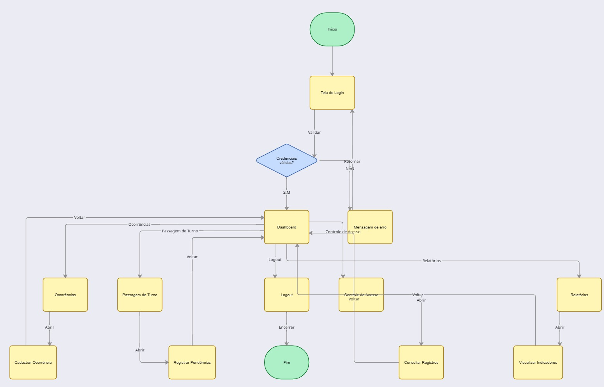

# Projeto de Interface

Visão geral da interação do usuário pelas telas do sistema e protótipo interativo das telas com as funcionalidades que fazem parte do sistema (wireframes).

## User flow

Fluxo de usuário (User Flow) é uma técnica que permite mapear toda a navegação do usuário dentro da aplicação. Essa técnica auxilia no planejamento da experiência do usuário, permitindo identificar os caminhos que cada perfil poderá percorrer durante a utilização do sistema.

Link do design no Figma: https://www.figma.com/make/McHP8sE4rVGdEymcUkCYXa/Criar-bot%C3%A3o-transl%C3%BAcido?p=f&t=N9PYKmi2wiSnbtMi-0

## Wireframes

Os wireframes são protótipos de baixa fidelidade utilizados para definir a estrutura das telas da aplicação. Eles apresentam a organização dos componentes da interface, facilitando a validação da experiência do usuário antes da criação do layout final.

Link do design no Figma: https://www.figma.com/SEU-LINK

## Protótipo interativo

[Clique aqui para acessar o protótipo interativo do SOC Insight no Figma](https://www.figma.com/SEU-LINK)

## Jornada do usuário

A jornada do usuário descreve, em alto nível de detalhes, as etapas realizadas pelos diferentes perfis dentro da aplicação para executar suas atividades diárias. Essa técnica permite compreender a experiência do usuário e identificar oportunidades de melhoria durante a navegação.

## Interface do sistema

### Interface do sistema

Abaixo estão apresentadas as interfaces finais da aplicação **SOC Insight** e suas respectivas funções:

**1. Tela de Login**

> **Função:** Permite que operadores, analistas e gestores acessem o sistema de forma segura por meio da autenticação de usuário.

**2. Dashboard Operacional**

> **Função:** Exibe indicadores em tempo real, como quantidade de ocorrências, eventos críticos, registros do dia, produtividade da equipe e demais métricas operacionais.

**3. Registro de Ocorrências**

> **Função:** Permite registrar, consultar, editar e acompanhar ocorrências operacionais, mantendo um histórico organizado de todos os eventos.

**4. Passagem de Turno**

> **Função:** Centraliza as pendências e informações importantes para o próximo turno, garantindo uma comunicação eficiente entre as equipes.

**5. Relatórios e Indicadores**

> **Função:** Apresenta gráficos, estatísticas e relatórios operacionais que auxiliam supervisores e gestores na análise dos dados e na tomada de decisões.

**6. Controle de Acesso**

> **Função:** Exibe os registros de entrada e saída de colaboradores, visitantes e prestadores de serviço, facilitando o monitoramento dos acessos.

**7. Perfil do Usuário**

> **Função:** Permite ao usuário visualizar e atualizar suas informações pessoais, alterar senha e configurar preferências do sistema.